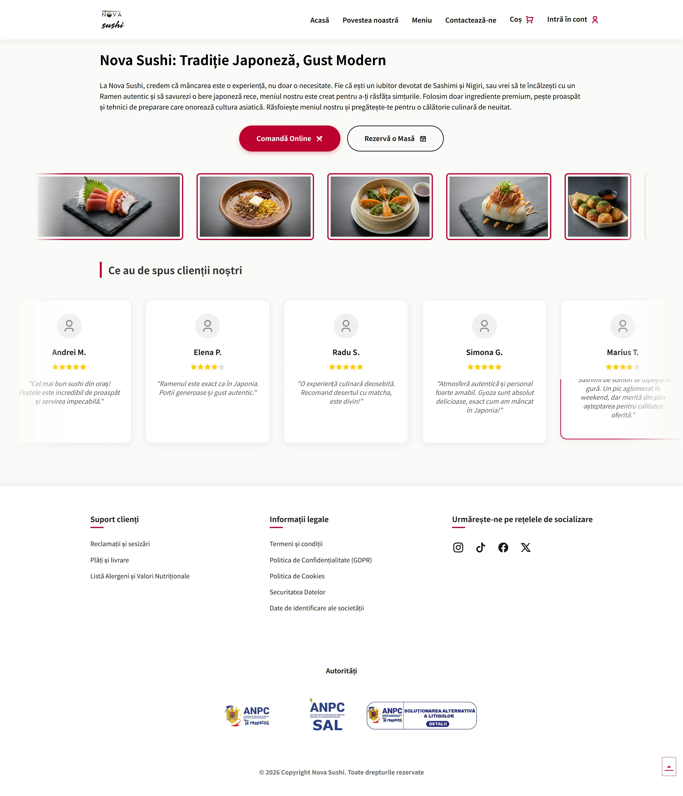
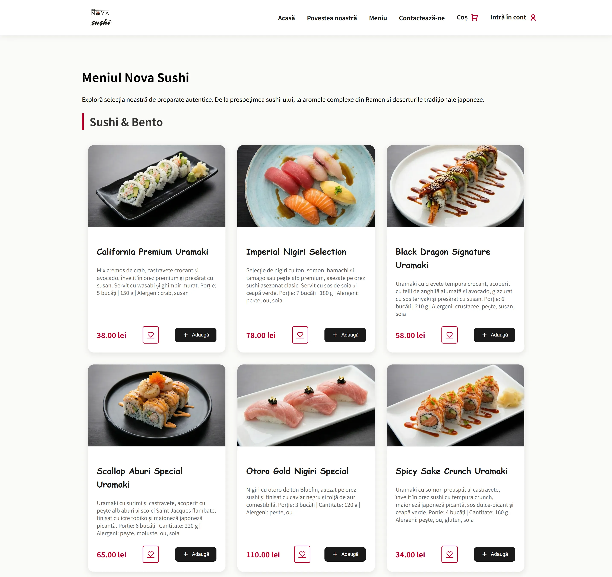
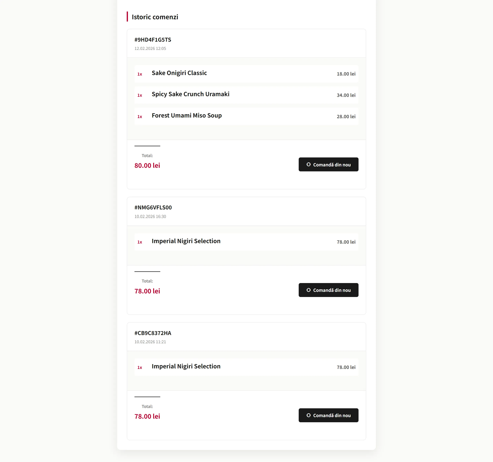
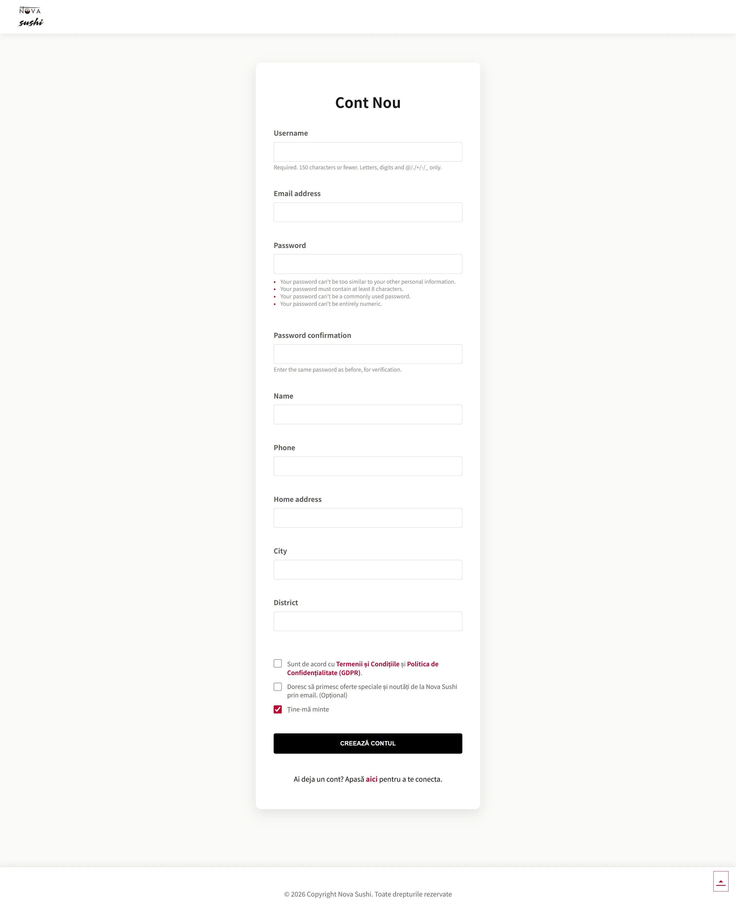
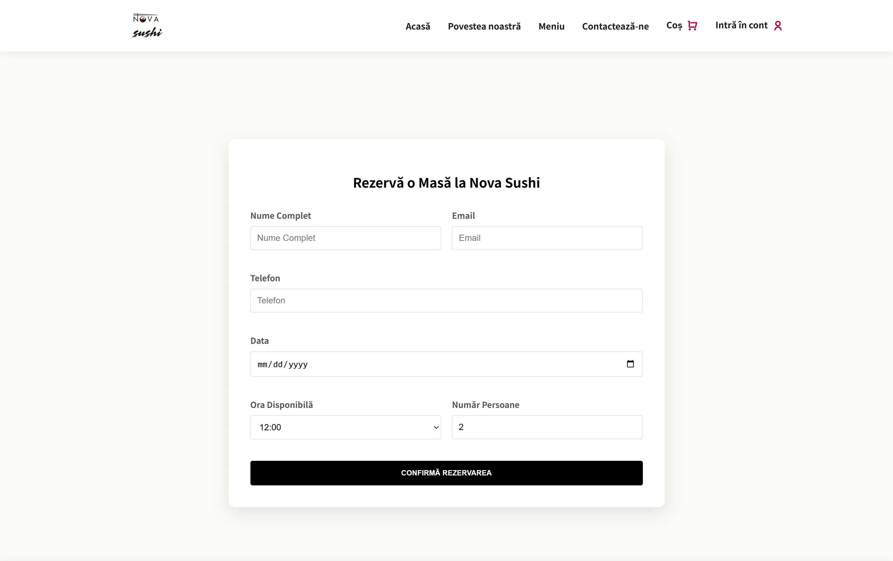
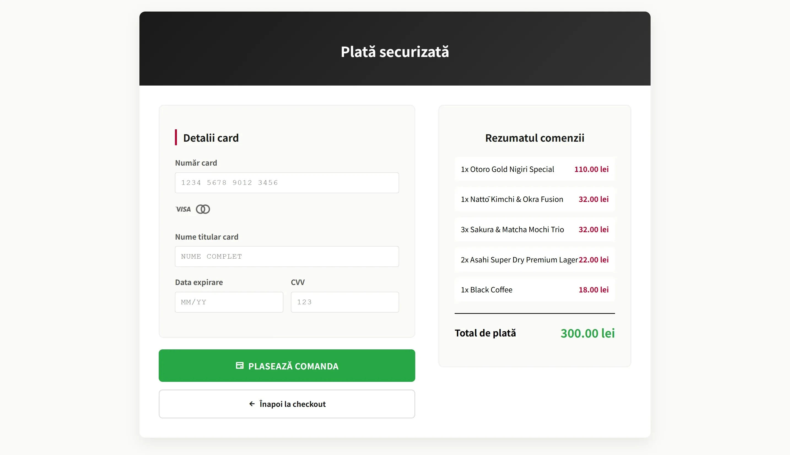
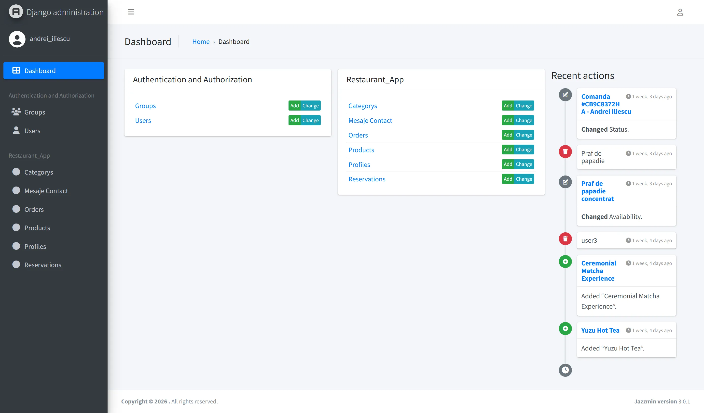

# 🍣 Nova Sushi Restaurant Web App

---


A full-stack web application for a sushi restaurant. Users can create accounts, manage their profiles, place orders, make reservations, and contact the restaurant. Admins can create, update, and delete menu items using custom-built management pages.

---

## Table of Contents

- [About](#about)
- [Features](#features)
- [Tech Stack](#tech-stack)
- [Screenshots](#screenshots)
- [Getting Started](#getting-started)
  - [Prerequisites](#prerequisites)
  - [Installation](#installation)
- [Environment Variables](#environment-variables)
- [Running Tests](#running-tests)
- [Project Structure](#project-structure)
- [Contributing](#contributing)
- [License](#license)
- [Contact](#contact)

---

## About

Nova Sushi is a Django-based web application built as a final project for a full-stack Python development course. The app covers the full user journey: registration, authentication, browsing the menu, placing orders, making reservations, and sending messages to the restaurant. The admin panel provides full CRUD control over the menu.

---

## Features

- User registration and authentication
- Profile management and order history
- Menu browsing with category filtering
- Order placement and tracking
- Table reservation system
- Contact form with message storage
- Admin panel with full CRUD for menu items
- Relational database models for users, orders, reservations, and messages

---

## Tech Stack

- Python 3.14.2
- Django 6.0.2
- SQLite
- HTML5, CSS3, JavaScript
- UnitTest

---

## Screenshots

**Homepage**



**Menu Page**



**Order History**



**Register Form**



**Reservation Form**



**Card Payment Page**



**Admin Panel**



---

## Getting Started

### Prerequisites

Make sure you have the following installed before running the project:

- Python 3.14.2
- pip
- virtualenv or venv

### Installation

1. Clone the repository:

```bash
git clone https://github.com/AndreiIliescu/sda-final-project.git
cd sda-final-project
```

2. Create and activate a virtual environment:

```bash
python -m venv .venv
source .venv/bin/activate          # macOS / Linux
.\.venv\Scripts\activate           # Windows - CMD
.\.venv\Scripts\activate.ps1       # Windows - PowerShell
```

3. Install the dependencies:

```bash
pip install -r requirements.txt
```

4. Apply the database migrations:

```bash
python.exe .\manage.py migrate
```

5. Create a superuser for the admin panel:

```bash
python.exe .\manage.py createsuperuser
```

6. Start the development server:

```bash
python.exe .\manage.py runserver
```

7. Open your browser and go to:

```
http://127.0.0.1:8000/
```

Admin panel is available at:

```
http://127.0.0.1:8000/admin/
```

---

## Environment Variables

Create a `.env` file in the root directory of the project. Use the `.env.example` file as a reference:

```env
SECRET_KEY=your_secret_key_here
DEBUG=True

DB_NAME = "your_database_name_here"

EMAIL_USER = "your_email_address_here"
EMAIL_PASSWORD = "your_google_app_password_here"
```

---

## Running Tests

Run all tests with:

```bash
python.exe .\manage.py test
```

---

## Project Structure

```
sda-final-project/
├── core_app/
│   ├── asgi.py
│   ├── settings.py
│   ├── urls.py
│   └── wsgi.py
├── docs/
│   └── schreenshots/
├── media/
│   └── products/
├── restaurant_app/
│   ├── templates/
│   |   ├── footer_pages/
│   |   │   └── cookie_policy.html
│   |   ├── base.html
│   |   ├── home.html
│   |   ├── about_us.html
│   |   ├── menu.html
│   |   └── contact_us.html
│   ├── admin.py
│   ├── apps.py
│   ├── forms.py
│   ├── models.py
│   ├── tests.py
│   └── views.py
├── static/
│   ├── css/
│   |   └── style.css
│   ├── favicons/
│   ├── images/
│   |   ├── about_images/
│   |   ├── carousel_images/
│   |   ├── footer_images/
│   |   └── logo.webp
│   └── js/
│       └── script.js
├── requirements.txt
├── runtime.txt
├── .env
├── .env.example
├── .gitignore
├── manage.py
├── LICENSE
└── README.md
```

---

## Contributing

1. Fork the repository
2. Create a new branch:

```bash
git checkout -b feature/your-feature-name
```

3. Commit your changes:

```bash
git commit -m "Add your feature description"
```

4. Push to the branch:

```bash
git push origin feature/your-feature-name
```

5. Open a Pull Request on GitHub

---

## License

Distributed under the MIT License. See the [LICENSE](LICENSE) file for details.

---

## Contact

**Iliescu Andrei**

[](mailto:andrei.iliescu13102000@outlook.com)

[](https://linkedin.com/in/andrei-iliescu-aa7910214)

[](https://github.com/AndreiIliescu)